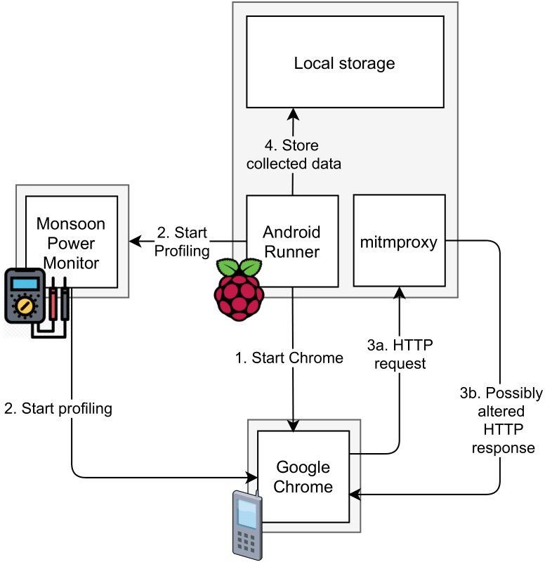

# MSc thesis - Replication package
This repository contains the replication package of my thesis called **The Impact of Resource Preloading and Resource Hints on theEnergy Consumption and Performance of Mobile Web Apps**.

The repository contains all material required for the replication of the two conducted experiments:

* All subjects and the scripts used during their selection process.
* Our measurement infrastructure consisting of  mitmproxy and a slightly modified version of the Android Runner framework.
* All the raw data collected during the execution of the experiments.
* The R notebooks for exploring, summarizing, and analyzing measurement data.

## Overview of the replication package
A high level overview of this repository's structure is shown below. 
```
├── android-runner                                  Source code of the Android Runner framework.
├── preloads                                        Contains all resources needed for the preload experiment.
│   ├── AR_config_preloads.json                     AR config file used for this experiment.
│   ├── data_analysis                               R scripts and plots used during the data analysis
│   ├── mitmproxy                                   Our mitmproxy plugin, the used config and all prerecorded responses. 
│   └── raw_data                                    Raw data of the experiment
├── resource_hints                                  Contains all resources needed for the resource hints experiment
│   ├── AR_config_resource_hints.json               AR config file used for this experiment
│   ├── data_analysis                               R scripts and plots used during the data analysis
│   ├── mitmproxy                                   Our mitmproxy plugin, the used config and all prerecorded responses.
│   └── raw_data                                    Raw data of this experiment
└── subject_selection                               All scripts used during our subject selection process.
    ├── scraper                                     Scraper used to mine 3K websites meeting our criteria.
    └── selection                                   
        ├── preloads                                Subjects used for the preload experiment.
        └── resource_hints                          Subjects used for the resource hints experiment.
```

## Replicating the experiment
Our measurement infrastructure is shown below and consists of three components: a mobile device, a RPi and the Monsoon HVPM.
<p align="center">
  
</p>

### Setup mitmproxy
1. Download and install mitmproxy from [here](https://mitmproxy.org/).
2. Configure mitmproxy on your mobile device by installing the required certificate and as shown [here](https://medium.com/testvagrant/intercept-ios-android-network-calls-using-mitmproxy-4d3c94831f62). Android requires you to set a lock-screen PIN to add a certificate. Based on your device's resolution and chosen pin you might have to change the `android-runner/examples/monsoon/scripts/after_run.py` script accordingly.
3. Download the recorded flows from the URLs provided in the .txt files.
4. Make sure mitmproxy uses the correct configuration file. Copy `config_preloads.yaml` or `config_hints.yaml` to `~/.mitmproxy `and rename it to config.yaml.
5. Start mitmproxy with our plugin by running `mitmdump -s preloads_plugin.py` or `mitmproxy -s resource_hints_plugin.py`. Please note that we are using mitmdump instead of mitmproxy!


### Setup Android Runner
1. Setup a Python virtual environment using `python3 -m venv .venv` and install the required dependencies for Android Runner as described [here](https://github.com/S2-group/android-runner/blob/master/CONTRIBUTING.md).
2. Setup the Monsoon HVPM following the guide [here](https://github.com/S2-group/android-runner/tree/master/AndroidRunner/Plugins/monsoon). Make sure you install the [original PyMonsoon package](https://github.com/msoon/PyMonsoon/tree/master/Monsoon) instead of [this forked version](https://github.com/luiscruz/PyMonsoon/tree/master/Monsoon).
3. Start the experiment by running  `sudo .venv/bin/python __main__.py AR_config_preloads.json` or `sudo .venv/bin/python __main__.py AR_config_resource_hints.json`.  Running the commands with `sudo` is only required if you are using the Monsoon HVPM.  
